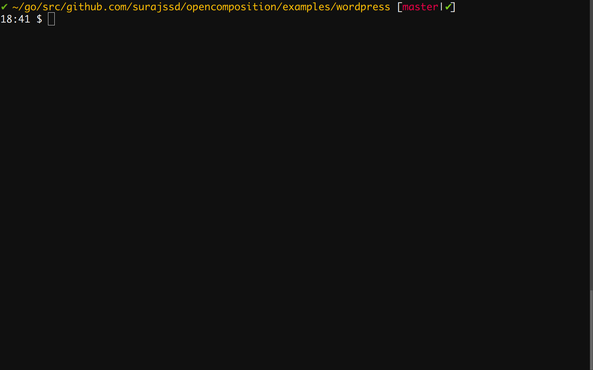

# Kapp (Kubernetes + App)

Experiment to openly composing apps for Kubernetes.



## Why?

You must be wondering why this project when we have other projects to do the same
the answer to that is below:

**Note**: User here is someone using the spec to define and deploy her
application.

#### Compared with OpenCompose

* No new language invented, using Kubernetes structs.
* Saves from inventing leaky abstractions.
* Someone defining apps here would find it easier in the world of Kubernetes.
* OpenCompose adds it's own abstractions which is new thing someone needs to
learn, while this approach keeps user near to Kubernetes.
* Also for every new feature a user needs to use she has to rely on OpenCompose
developers to add it to the tool and language, while this approach gives lot of
functionality out of the box.

#### Compared with Kubernetes artifacts

* No need to define everything that Kubernetes needs, define necessary things
and other things will be assumed as defaults by the tool.
* User can choose to define minimum required essentials or define
each and everything by herself.


## Install

```bash
go get github.com/surajssd/kapp
```

## Usage

```bash
$ kapp convert -f examples/wordpress/web.yaml -f examples/wordpress/db.yaml
---
apiVersion: extensions/v1beta1
kind: Deployment
metadata:
  creationTimestamp: null
  labels:
    app: web
  name: web
spec:
  replicas: 2
  strategy: {}
...
```

Goto [examples](examples) directory to find more examples where the way to define apps is
also documented.


## TODOs

* Root level `services` are confusing so find a better name for it, also consider
moving it somewhere else.
* The way secrets and configmaps are referred in containers.env it is too much
indirection, making it easier.
* `persistentVolumes`, `configData` are confusing terms rename them.
* Add convenient shortcuts to the make `configMapKeyRef` and `secretKeyRef`
usage becomes easier.
* Add such shortcuts to other part of the spec, but user can choose to use
shortcuts or define everything without having to use shortcuts.
* Improve the way volume definition is done, size is not common to everything
it's only in `pvc`.
* Create intelligent defaults to the tool, to reduce what a user will write.
* Generate OpenShift artifacts? All things related to OpenShift like builds,
routes, etc.
* Fields could be renamed to have easier or better name.
